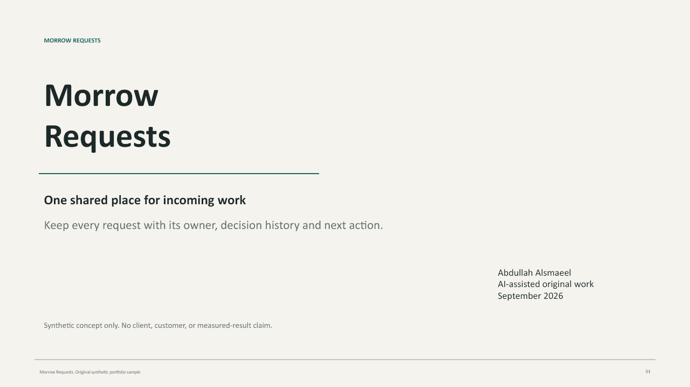
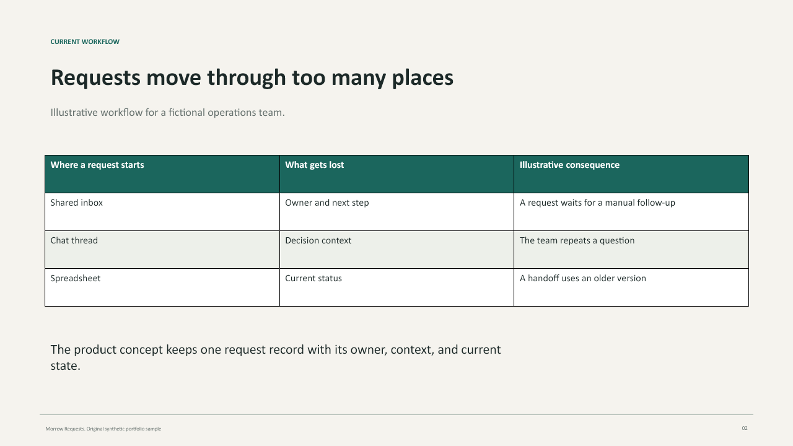
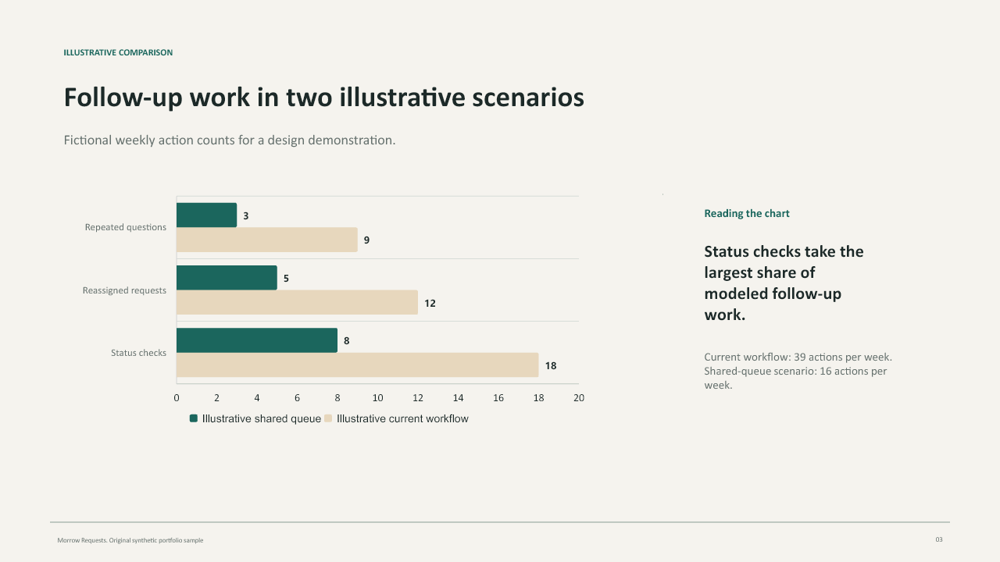
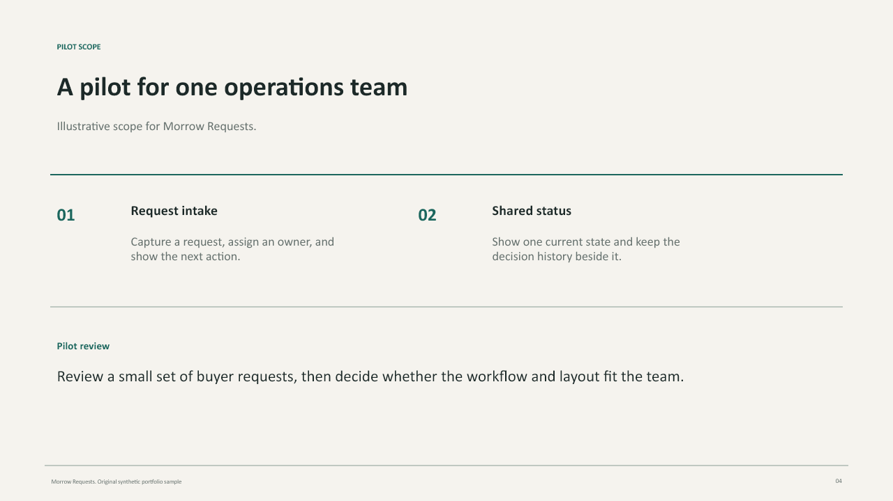

# Morrow Requests: presentation layout sample

An original, AI-assisted four-slide presentation by Abdullah Alsmaeel. Morrow Requests is a fictional product. All chart values are illustrative, with no client or measured-result claims.

[Open the four-page PDF preview](morrow-requests-sample.pdf) · [Download the editable PowerPoint](morrow-requests-sample.pptx)

## Preview

### 1. Title and value statement

### 2. Workflow table

### 3. Quantitative comparison

### 4. Pilot scope

## What this demonstrates

Consistent slide layout, typography and spacing; an editable table; and a native chart with an embedded workbook. The PowerPoint contains four slides, one table and one chart. The PDF is a raster preview for easy review.

All four slide renders and all four PDF pages were visually reviewed. The PPTX passed package and artifact-tool import checks. Desktop PowerPoint rendering and editing have not been verified.

## Request a paid pilot

For presentation cleanup, an indicative USD95 covers up to five slides using supplied content, one revision, an editable PPTX and a PDF. Final scope, price, deadline and payment terms are agreed before work begins.

Send the slide count, desired format, brand guidance and deadline through [my LinkedIn service page](https://www.linkedin.com/services/page/0a9076347398a204b5/). Keep private files out of public GitHub issues.

[All work samples](../README.md)
