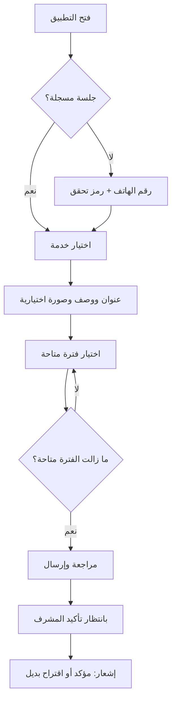

# نموذج تحليلي افتراضي: «مصلّحك» لحجز صيانة منزلية

> **عينة عمل ذاتية ومصطنعة بالكامل (Synthetic portfolio sample).** هذا المستند لا يخص عميلاً حقيقياً، ولا يصف تطبيقاً منشوراً أو عملاً مدفوعاً سابقاً. الأسماء والأرقام والافتراضات أدناه توضيحية فقط، ويمكن استخدامها كنموذج لطريقة تحليل منتج قبل البدء.

## 1) الملخص والافتراضات

**مصلّحك** تطبيق جوال افتراضي لشركة صيانة صغيرة تعمل في مدينة واحدة وتقدم كهرباء وسباكة وتكييف. اليوم تصل الطلبات عبر الهاتف وواتساب، فيضيع الوقت بين سؤال العميل عن العطل، البحث عن فني متاح، وتأكيد الموعد. هدف النسخة الأولى هو تحويل ذلك إلى حجز واضح قابل للإدارة: يختار العميل الخدمة والموعد، يؤكد المشرف الطلب، ويرى الفني مهامه فقط.

نفترض فريقاً من 3--10 فنيين، منطقة خدمة محددة، لغة عربية أولاً مع واجهة إنجليزية لاحقاً، والدفع عند إنجاز الخدمة أو برابط دفع خارج نطاق النسخة الأولى. لا يوجد تشخيص طبي، ولا سوق متعدد المزودين، ولا تتبع حي للمركبات، ولا تسعير ملزم آلياً. السعر المعروض هو «رسوم كشف تبدأ من…»؛ السعر النهائي يقرّه الفني بعد المعاينة. النجاح خلال أول 90 يوماً: 60% من الطلبات تأتي من التطبيق، 70% من المواعيد المؤكدة تُنجز، وانخفاض المكالمات اليدوية لكل حجز بنسبة 30%. هذه أهداف فرضية يلزم اعتمادها مع مالك النشاط قبل التنفيذ.

## 2) المشكلة، المستخدمون، والنتائج

| الدور | الحاجة الأساسية | ما يراه/يفعله |
|---|---|---|
| العميل | موعد موثوق ومعرفة ما سيحدث | إنشاء طلب، اختيار فترة زمنية، رفع صورة اختيارية، متابعة الحالة، إلغاء ضمن السياسة |
| الفني | قائمة عمل لا تتضارب مع وقته | مشاهدة طلباته المعينة، قبول/تعذر، بدء المهمة وإنهاؤها، إضافة ملاحظة داخلية |
| المشرف (Admin) | تنظيم السعة وخدمة العملاء | ضبط الخدمات والفترات والفنيين، مراجعة الطلبات، تعيين/إعادة تعيين، إغلاق الشكاوى والتقارير |

المؤشرات التشغيلية: نسبة إتمام الحجز، وقت تأكيد الطلب، نسبة عدم الحضور، ونسبة الطلبات المعاد فتحها. لا نقيس «وقت التطبيق» كهدف بحد ذاته. لكل حدث تعريف ثابت: الحجز المؤكد هو طلب له فني وفترة زمنية؛ المكتمل هو طلب أغلقه المشرف أو الفني بعد إثبات مختصر؛ والملغى يستثنى من الإتمام.

## 3) PRD مختصر

### نطاق المنتج

يدعم التطبيق تسجيل العميل برقم الهاتف والتحقق برمز لمرة واحدة، ملفاً بسيطاً، عناوين خدمة، كتالوج خدمات، فترات متاحة، طلب صيانة، إشعارات حالة، وسجل طلبات. يدعم تطبيق/واجهة الفني المصادقة، حالة التوفر، قائمة المهام، وتحديث الحالة. تدعم لوحة المشرف إدارة السعة والتعيين والتصدير CSV. تبقى محادثة واتساب، القسائم، تقييمات عامة، اشتراكات، دفع داخل التطبيق، والتوسع لمدن أخرى خارج MVP.

**متطلبات وظيفية.** عند طلب جديد يجمع النظام: نوع الخدمة، عنواناً، فترة زمنية، وصفاً قصيراً، ورقم اتصال مؤكد؛ الصورة اختيارية. يمنع الحجز في فترة ممتلئة أو خارج منطقة الخدمة. ينشأ الطلب بحالة `بانتظار التأكيد`، ثم `مؤكد` بعد التعيين، ثم `في الطريق` اختيارياً، `جارٍ التنفيذ`، و`مكتمل` أو `ملغى`. يسجل كل انتقال هوية المنفذ والوقت. يختار المشرف فنيّاً متاحاً ولا يسمح النظام بتعارض مهمتين لنفس الفني. تصل إشعارات عند التأكيد والتغيير والإلغاء، مع رابط تفصيلي يعمل من دون إظهار بيانات عميل لغير صاحب الطلب.

**متطلبات جودة.** تصميم RTL كامل، نصوص عربية قابلة للفهم، عمل جيد على شاشات الهاتف الشائعة، وواجهة يمكن الوصول إليها (تسميات قارئ الشاشة، تباين، وحجم لمس مناسب). الهدف الاسترشادي: فتح القائمة أو السجل خلال ثانيتين على اتصال متوسط، وإنشاء طلب لا يزيد عن خمس شاشات. يحتفظ النظام بأقل بيانات ممكنة، يشفر النقل، ويقيد المشرف بواجهة صلاحيات. لا يطلب الموقع الدقيق أو الصور أو الإشعارات إلا عند الحاجة وبشرح الغرض.

**قصص قبول مختارة.** كعميل، أستطيع رؤية أول فترة متاحة قبل إرسال الطلب، وأتلقى نتيجة واضحة إذا امتلأت الفترة أثناء الحجز. كفني، لا أرى رقم العميل الكامل أو عنوانه إلا بعد تعيين المهمة لي. كمشرف، أستطيع إعادة تعيين طلب مع سجل السبب، ولا يتغير موعد العميل بصمت. كل رسالة تأكيد تذكر الخدمة والفترة والعنوان المختصر وطريقة الإلغاء.

## 4) تدفقات الاستخدام

### العميل: إنشاء حجز

### المشرف والفني: تنفيذ الخدمة

## 5) الحالات الاستثنائية وإساءة الاستخدام

| الحالة | السلوك المطلوب | المعالجة/المالك |
|---|---|---|
| فترتان تُحجزان آخر مقعد | قفل حجز ذري؛ تقبل الأولى فقط | رسالة اختيار وقت آخر للعميل |
| لا يوجد فني | لا تأكيد تلقائي | المشرف يقترح فترة أو يلغي مع سبب |
| رمز OTP متكرر/مسيء | حد للمحاولات وإبطاء مؤقت | دعم يستقبل بلاغاً؛ لا يكشف وجود رقم |
| صورة تحوي بيانات حساسة أو محتوى مسيئاً | تحذير قبل الرفع وحدود نوع/حجم | حذف/حجب إداري وسجل تدقيق |
| فني يغلق دون حضور | لا يكفي تحديث فني وحده للحالات المتنازع عليها | المشرف يراجع ويعيد فتح الطلب |
| إلغاء متأخر | تعرض السياسة قبل التأكيد | يحال للمشرف؛ لا غرامة آلية في MVP |
| انقطاع الشبكة | لا تظهر العملية مكتملة بلا تأكيد خادم | إعادة محاولة آمنة بمعرّف طلب |
| فقدان جهاز/جلسة | إنهاء الجلسة وتغيير الرقم عبر تحقق | دعم بصلاحية محدودة وسجل |

## 6) ترتيب MVP وخطة التنفيذ

| الأولوية | العنصر | سبب الإدراج/التأجيل |
|---|---|---|
| P0 | OTP، الملف والعناوين، الخدمات، الفترات، إنشاء الطلب والحالات | المسار الأساسي للحجز |
| P0 | لوحة مشرف للتعيين والسعة، تطبيق الفني، إشعارات، سجل تدقيق | يمنع الحجز الوهمي ويتيح التشغيل |
| P1 | صور، إعادة جدولة ذاتية، تصدير CSV، تقييم داخلي للطلب | يحسن الدعم بعد ثبات الأساس |
| P2 | دفع داخل التطبيق، خرائط حية، كوبونات، تعدد المدن | يحتاج قرارات تجارية وتشغيلية إضافية |

اقتراح 8 أسابيع: أسبوع 1 لاكتشاف الخدمة وسياسة الإلغاء والنماذج؛ 2--3 تصميم RTL ونموذج قابل للاختبار؛ 4--6 بناء المسارات P0 وواجهة المشرف؛ 7 اختبار قبول مع بيانات وهمية وفريق تجريبي؛ 8 إصدار محدود لمدينة واحدة ومراجعة القياسات. البوابة بين كل مرحلة هي اعتماد مالك النشاط للأمثلة النصية وقواعد السعة، لا مجرد اكتمال الشاشات.

## 7) خيارات التقنية وقرار مبدئي

| الخيار | الملاءمة | المقايضة |
|---|---|---|
| Flutter + API TypeScript + PostgreSQL | تطبيق iOS/Android واحد وسرعة MVP جيدة | يلزم ضبط الجسور/الإضافات بعناية |
| React Native + TypeScript + API TypeScript | مشاركة معرفة الويب وسرعة التوظيف | تفاوت المكتبات الأصلية وإدارة الترقيات |
| Native Swift/Kotlin + API | أفضل تكامل منصة وتحكم طويل الأجل | تكلفة تطوير وصيانة أعلى لفريق صغير |

الاختيار المبدئي: Flutter مع API TypeScript وPostgreSQL، لأن المشكلة ليست مرتبطة بميزة أصلية معقدة، مع واجهة ويب للمشرف. يستخدم خادم وقت موحد، معاملات قاعدة بيانات للسعة، تخزيناً خاصاً للصور بعناوين موقعة قصيرة العمر، ومزود SMS قابل للاستبدال. هذا قرار افتراضي؛ يراجع بعد معرفة فريق العميل، الدولة، ومزود الرسائل والدفع. لا تُدرج مفاتيح أو بيانات عملاء في التطبيق أو المستودع.

## 8) جاهزية المتاجر والإطلاق

قبل الإرسال يُكمل الفريق اسم التطبيق ووصفه ولقطاته وفئة العمر وبيانات التواصل وسياسة خصوصية متاحة علناً ودقيقة، مع إجابات متاجر تعكس البيانات الفعلية لا النوايا. إن أتيح إنشاء حساب، يتضمن المنتج حذف الحساب من داخل التطبيق؛ وعلى Google Play توجد أيضاً صفحة ويب لطلب الحذف، وفق إرشادات Google. تجمع Apple معلومات خصوصية التطبيق عند كل تقديم، وتلزم دقة الإفصاح. روابط مرجعية رسمية: [Apple: حذف الحساب داخل التطبيق](https://developer.apple.com/support/offering-account-deletion-in-your-app)، [Apple: خصوصية التطبيق واستخدام البيانات](https://developer.apple.com/app-store/user-privacy-and-data-use/)، [Google Play: حذف الحساب](https://support.google.com/googleplay/android-developer/answer/13327111?hl=en)، [Google Play: سياسة بيانات المستخدم](https://support.google.com/googleplay/android-developer/answer/10144311?hl=en-GB).

لا يدّعي هذا النموذج الامتثال النهائي: يجب التحقق من المتطلبات والسياسات النافذة عند الإرسال بحسب البلد، SDKs، الأذونات، المدفوعات، وميزات التطبيق الفعلية. قائمة إطلاق عملية: مراجعة نصوص الموافقة والأذونات؛ اختبار حذف الحساب وبياناته؛ إكمال Privacy Nutrition Labels وData safety بدقة؛ اختبار رابط الدعم وسياسة الخصوصية؛ تجربة مسارات العميل والفني والمشرف على أجهزة فعلية؛ فحص الأعطال والتحليلات دون بيانات حساسة؛ اختبار النسخ الاحتياطي والاسترجاع وسجل التدقيق؛ تجربة داخلية ثم اختبار مغلق؛ مراقبة الحجز الفاشل ووقت التأكيد يومياً؛ وخطة تراجع توقف التسجيل الجديد وتحوّل الطلبات للدعم الهاتفي مع الحفاظ على المواعيد المؤكدة.

في الأسبوع الأول من الإطلاق المحدود، يراجع المشرف يومياً الطلبات غير المعينة والإلغاءات والشكاوى؛ وفي نهاية الأسبوع يجمع خمس مقابلات قصيرة مع عملاء وفنيين. قرار التوسع يتطلب ثبات الإتمام والرضا التشغيلي، لا مجرد عدد تنزيلات.

